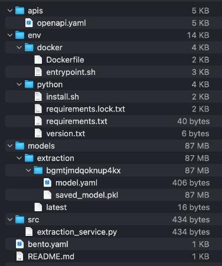

## Containerization of AIs

To ensure safety, flexibility, retrocompatibility and independency, we store and run AIs using 
[Bento ML](https://docs.bentoml.org/en/latest/?_gl=1*hctmyy*_gcl_au*NzY2ODYxNDY1LjE3MDY1MzU5NTk.#) containerization 
framework. 

When a model is saved, it uses the latest schema version from `bento.ai_type.schemas.py` which specifies how the service 
communicates with the Server. After that, a model becomes part of a Bento archive.

Inside the Bento archive, there are a lockfile with dependencies, the Python runtime version, the pickled model itself, 
a Dockerfile and a Python file that serves a REST API for the model. It also specifies the schema version for this model.



To save a model as a Bento instance, use `save_bento()` method of an AI class that you want to save, for instance:

```python
from konfuzio_sdk.trainer.information_extraction import RFExtractionAI

model = RFExtractionAI()
model.save_bento()
```

Running this command will result in a Bento creation in your local Bento storage. If you wish to specify an output for
a Bento archive, you can do this via the following command:

```python
model.save_bento(output_dir='path/to/your/bento/archive.bento')
```

The resulting Bento archive can be uploaded as a custom AI to the Server or an on-prem installation of Konfuzio. 

If you want to test that your Bento instance of a model runs, you can serve it locally using the next command:

```commandline
bentoml serve name:version # for example, extraction_11:2qytjiwhoc7flhbp
```

After that, you can check the Swagger for the Bento on `0.0.0.0:3000` and send requests to the available endpoint(s).

To run a Bento instance as a container and test it, use a following command:

```commandline
bentoml containerize name:version # for example, extraction_11:2qytjiwhoc7flhbp
```
