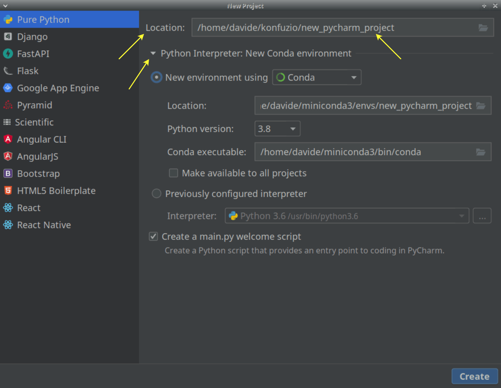
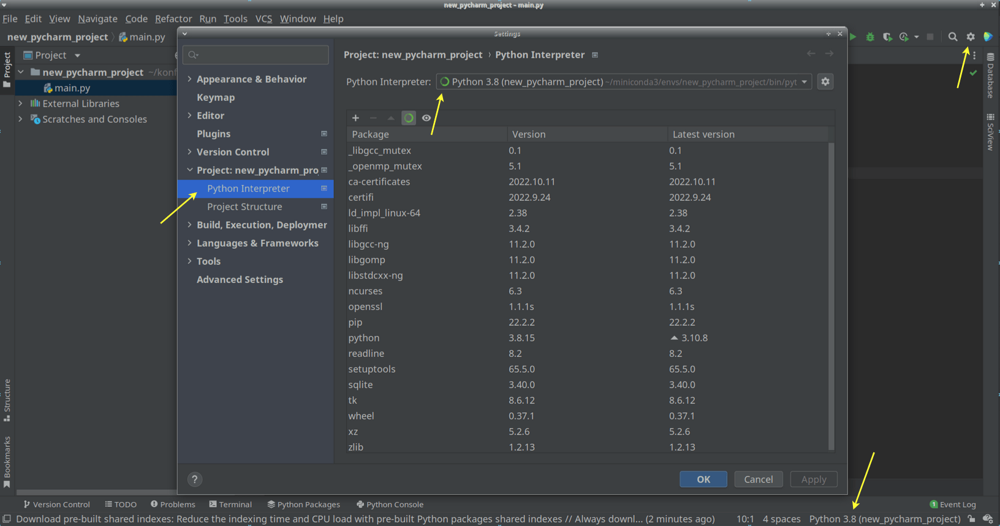
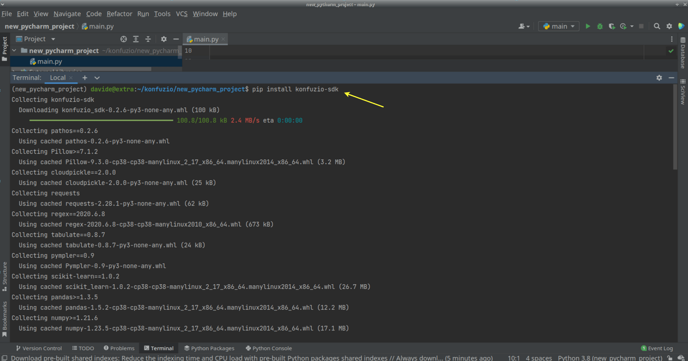
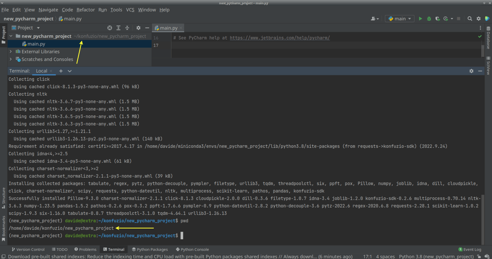
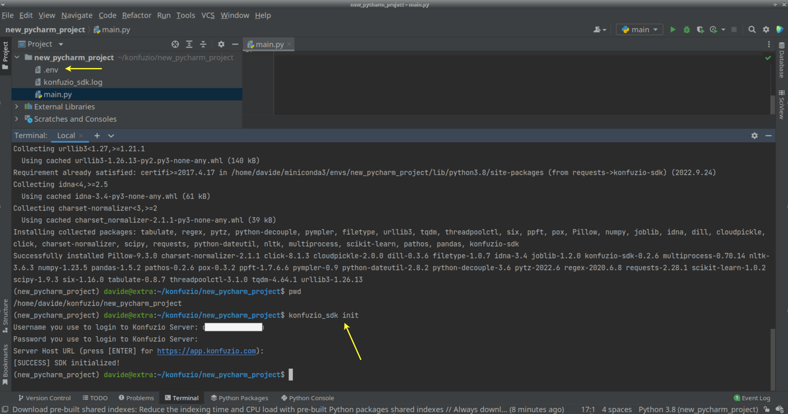

.. meta::
:description: Contains all necessary steps to use the sdk with pycharm.

.. _Install SDK using PyCharm:

## Install SDK using PyCharm

This guide explains the necessary steps to use the [Konfuzio SDK](https://github.com/konfuzio-ai/konfuzio-sdk)
(version >=0.2) with PyCharm.

It was tested on the following Operating Systems and PyCharm versions:
- Ubuntu 18.04 with PyCharm 2021.3.3 (Professional Edition)
- Windows 10 with PyCharm 2022.1.4 (Professional Edition)
- macOS 12 with PyCharm 2022.2.1 (Community Edition)

#### 1. PyCharm Setup

PyCharm is a widespread common Integrated Development Environment (IDE) with strong debugging functionalities, which is
why we choose PyCharm as our preferred IDE in this context. To start with, please download the Community version of
PyCharm for your respective operating system here: https://www.jetbrains.com/pycharm/download/.

Once it is downloaded, create a new Project in PyCharm (File -> New Project) and choose the location and name for it.
Please also refer to this documentation for further
explanations: https://www.jetbrains.com/help/pycharm/creating-empty-project.html. When creating a new project, you need
to choose the Python interpreter which will be used for the project. Please move on to step 2 to check how to create a
new virtual environment for the project.



#### 2. Create a Virtual Environment

As we want to execute our project with our Konfuzio SDK package, we need a virtual environment that is based on Python
version 3.8. This Python version is the most widespread and commonly used version which still represents a good
trade-off between newness and stability. To create such a virtual environment, please refer to this documentation which
describes the steps in
detail: https://www.jetbrains.com/help/pycharm/creating-virtual-environment.html#python_create_virtual_env.

To connect this virtual environment to your project, make sure that it is selected as the Python interpreter (see bottom
right corner) and in the project setting preferences if not already specified when the project was created. We are using
a local virtual environment in combination with the community version of PyCharm, as the users of the community version
can't carry out debugging of code that is executed in Docker containers or on a remote-host SSH.



After the installation of PyCharm and this setup of the virtual environment is completed, we can now start to install
our Konfuzio SDK package.

#### 3. Install the Konfuzio SDK package

Install the Konfuzio SDK package via pip install in the terminal. This will install the SDK package directly in your
working directory:
`pip install konfuzio-sdk`



#### 4. Define your working directory

To store data downloaded with the Konfuzio SDK, indicate (if necessary) the location by inputting the path of your
working directory. This path should be the location of the folder of the PyCharm project and can be found e.g. on the
top left corner.
`cd <your working directory>`



#### 5. Initialize the project with the required inputs

After the installation, initialize the package in your working directory with:
`konfuzio_sdk init`

This will require different inputs, starting with your **login credentials** to access the Konfuzio Server. It will then
ask for the **host** from where to get the data. If you are a business user, this might be different from
app.konfuzio.com and will be the server URL to access the Konfuzio application. In any other case, press "enter" to use
the default URL as the host address.

You successfully initialized your project!

Now your Konfuzio SDK package is locally installed and will enable you together with the usage of the API the usage of
the Konfuzio web interface.

One file have also been created in your working directory: .env. The .env file contains the credentials
to access the app and must not become public.



#### 6. Test your Setup

If you are new to our Konfuzio application, there are no existing projects yet. Create a new one 
[online](https://www.youtube.com/watch?v=KJC48LMvM2I&t=50s) and then use the **project ID** in your following code.

To test whether everything is working as desired, we are going to execute a few basic commands in the main.py file.
Therefore, please remove the current sample Python script provided by PyCharm by deleting the code. We start with
initializing the project to retrieve the current version of the project from the web application. The screenshot shows
the project ID 1290; you should replace this with your own. Once this is done, we count the total number of all
documents allocated to the train set in the project.

To run the code, press "Run" and then "Run main". You will noticethat a data folder gets created, containing your
project files.As we didn't upload any documents to our project yet, the total number should be 0.

```
# Test your setup with the following code:

from konfuzio_sdk.data import Project

# Initialize the project:
my_project = Project(id_=YOUR_PROJECT_ID)

# Receive the total number of training documents in the project:
print(f"Number of training documents in the project: {len(my_project.documents)}.")

```


#### 7. Test the Debugging

We include a second test to check if the debugging also works. Therefore, we include a breakpoint in the last line of
the code in the line of the print statement and execute "Run" and then "Debug main". This will provide you with an
overview of all available variables. As you can see in the code above, we only accessed the document element - however,
all other elements can be found and explored in the Debug console under "Variables".


